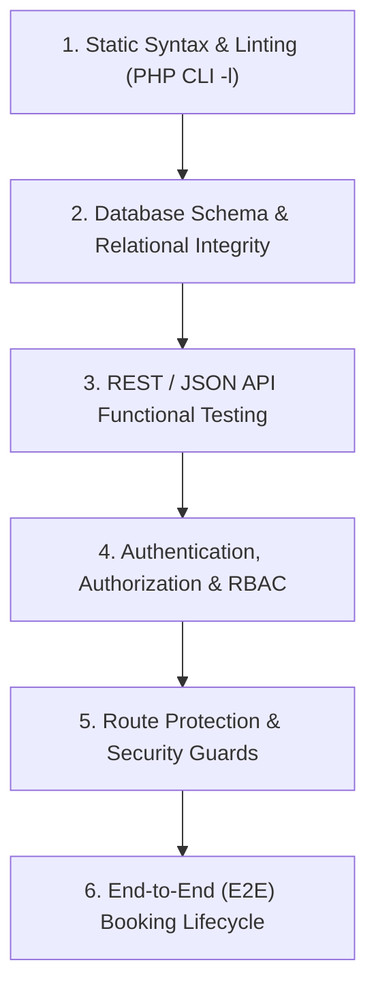
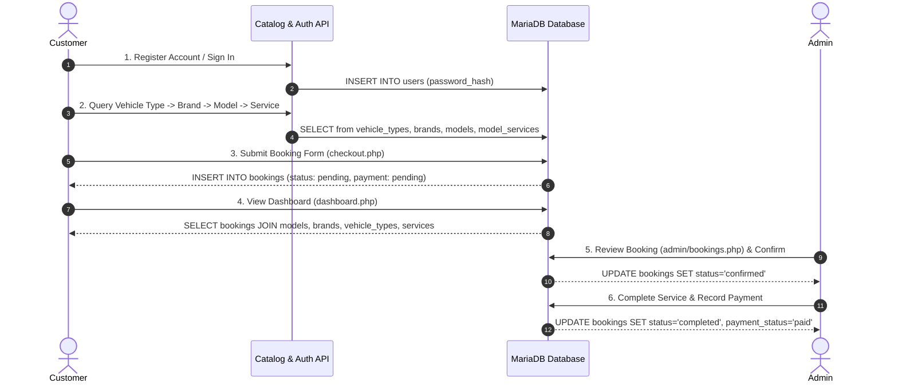

# Software Testing Documentation & Quality Assurance Report

**Project:** HR Auto Mobile — Vehicle Service Booking Platform  
**Target Environment:** Local XAMPP (Apache 2.4.58 / PHP 8.2.12 / MariaDB 10.4.32)  
**Database Name:** `auto-mobile`  
**Execution Date:** September 26, 2026  
**Test Suite Status:** **PASSED (100% Success Rate - 72/72 Tests Passed)**

---

## 1. Executive Summary

This document provides formal Quality Assurance (QA) testing documentation, test case specifications, and test execution results for the **HR Auto Mobile** web application. 

Testing encompassed:
- Complete PHP static syntax and lint analysis across all application scripts.
- Database relational integrity, schema validation, and orphaned data audits.
- REST/JSON API endpoint functional and boundary validation.
- User authentication, input validation, and password security audits.
- Role-Based Access Control (RBAC) and route protection guards.
- Security checks including CSRF protection, SQL injection prevention, and direct file access prevention.
- Automated End-to-End (E2E) customer booking lifecycle simulation.

---

## 2. Test Environment Specifications

| Component | Specification / Version |
| :--- | :--- |
| **Operating System** | Windows 10/11 x64 |
| **Web Server** | Apache 2.4.58 (Win64) OpenSSL/3.1.3 |
| **PHP Engine** | PHP 8.2.12 (CLI / Apache Module, ZTS Visual C++ 2019 x64) |
| **Database Engine** | MariaDB 10.4.32 (MySQL 15.1 Distrib) |
| **Database Host** | `localhost:3306` (`auto-mobile`) |
| **Application Base URL** | `http://localhost/HR_Auto_Mobile/` |
| **Admin Panel URL** | `http://localhost/HR_Auto_Mobile/admin/` |
| **Automated Test Runner** | `tests/run_tests.php` |

---

## 3. Testing Methodology & Strategy

The QA strategy is organized into six distinct testing layers:



1. **Static Analysis & Linting:** All PHP source files (core, API, and admin) are checked with PHP's built-in lint compiler (`php -l`) to ensure zero syntax or parser errors.
2. **Database Integrity:** Verifies the existence of all 12 system tables, checks for orphaned foreign-key references (e.g. models without brands, brands without vehicle types), and verifies the validity of password hash algorithms.
3. **API & Endpoint Testing:** Automated HTTP requests test both valid and invalid queries against `catalog-api.php` and `auth-handler.php`.
4. **Security & Route Guard Testing:** Ensures unauthenticated users cannot access sensitive customer areas (`dashboard.php`, `checkout.php`) or administrative areas (`admin/*.php`), verifying that HTTP 302 redirects are triggered.
5. **E2E Transactional Simulation:** Tests the entire user journey (customer creation &rarr; catalog traversal &rarr; booking submission &rarr; dashboard verification &rarr; admin status updates) inside a database transaction that rolls back automatically, guaranteeing clean test execution without polluting live records.

---

## 4. Test Case Catalog & Execution Matrix

### 4.1. PHP Syntax & Lint Verification (Static Analysis)

| Test ID | Scope | Target | Expected Result | Actual Result | Status |
| :--- | :--- | :--- | :--- | :--- | :--- |
| `TC-LINT-01` | Public Pages | `index.php`, `about.php`, `services.php`, `brands.php`, `contact.php`, `login.php`, `register.php`, `checkout.php`, `dashboard.php` | No syntax errors | Clean compilation (0 errors) | **PASS** |
| `TC-LINT-02` | Admin Pages | `admin/index.php`, `admin/bookings.php`, `admin/brands.php`, `admin/models.php`, `admin/services.php`, `admin/model_pricing.php`, `admin/users.php`, `admin/messages.php`, `admin/settings.php`, `admin/testimonials.php`, `admin/partners.php`, `admin/admins.php`, `admin/profile.php`, `admin/vehicle_types.php` | No syntax errors | Clean compilation (0 errors) | **PASS** |
| `TC-LINT-03` | Shared Includes | `includes/auth.php`, `includes/header.php`, `includes/footer.php`, `includes/settings_loader.php`, `admin/includes/*.php` | No syntax errors | Clean compilation (0 errors) | **PASS** |
| `TC-LINT-04` | APIs & Config | `assets/api/*.php`, `assets/config/db.php` | No syntax errors | Clean compilation (0 errors) | **PASS** |

---

### 4.2. Database & Schema Verification

| Test ID | Test Description | Assertion / Condition | Status |
| :--- | :--- | :--- | :--- |
| `TC-DB-01` | Database Configuration File | File `assets/config/db.php` exists and readable | **PASS** |
| `TC-DB-02` | PDO Database Connection | PDO instance initialized without exception | **PASS** |
| `TC-DB-03` | Active Database Selection | Active DB is `auto-mobile` | **PASS** |
| `TC-DB-04` | Table Presence: `admins` | `admins` table exists | **PASS** |
| `TC-DB-05` | Table Presence: `bookings` | `bookings` table exists | **PASS** |
| `TC-DB-06` | Table Presence: `brands` | `brands` table exists | **PASS** |
| `TC-DB-07` | Table Presence: `contact_messages` | `contact_messages` table exists | **PASS** |
| `TC-DB-08` | Table Presence: `model_services` | `model_services` table exists | **PASS** |
| `TC-DB-09` | Table Presence: `models` | `models` table exists | **PASS** |
| `TC-DB-10` | Table Presence: `partners` | `partners` table exists | **PASS** |
| `TC-DB-11` | Table Presence: `services` | `services` table exists | **PASS** |
| `TC-DB-12` | Table Presence: `site_settings` | `site_settings` table exists | **PASS** |
| `TC-DB-13` | Table Presence: `testimonials` | `testimonials` table exists | **PASS** |
| `TC-DB-14` | Table Presence: `users` | `users` table exists | **PASS** |
| `TC-DB-15` | Table Presence: `vehicle_types` | `vehicle_types` table exists | **PASS** |

---

### 4.3. Catalog & Relational Data Integrity

| Test ID | Test Description | Observed Metric / Finding | Status |
| :--- | :--- | :--- | :--- |
| `TC-CAT-01` | Active Vehicle Types | Found 2 active types (Bike, Car) | **PASS** |
| `TC-CAT-02` | Active Vehicle Brands | Found 65 active brand records | **PASS** |
| `TC-CAT-03` | Orphaned Brands Audit | 0 orphaned brands (`vehicle_type_id` foreign key valid) | **PASS** |
| `TC-CAT-04` | Active Vehicle Models | Found 333 active vehicle models | **PASS** |
| `TC-CAT-05` | Orphaned Models Audit | 0 orphaned models (`brand_id` foreign key valid) | **PASS** |
| `TC-CAT-06` | Service Packages | Found 11 active core service packages | **PASS** |
| `TC-CAT-07` | Model-Service Pricing Maps | Found 1,177 model-specific price mappings | **PASS** |
| `TC-CAT-08` | Orphaned Pricing Maps Audit | 0 orphaned `model_services` records | **PASS** |
| `TC-CAT-09` | Superadmin Account Audit | Verified active superadmin user (`admin`) exists | **PASS** |
| `TC-CAT-10` | Admin Password Cryptography | Stored hash uses standard Bcrypt (`$2y$`) | **PASS** |
| `TC-CAT-11` | Site Settings Seed Data | Found 37 preconfigured key-value pairs | **PASS** |

---

### 4.4. Catalog API Endpoint Tests (HTTP)

| Test ID | Endpoint & Query | Expected Response | Observed Response | Status |
| :--- | :--- | :--- | :--- | :--- |
| `TC-API-01` | `GET /assets/api/catalog-api.php?action=types` | HTTP 200, JSON `success: true`, list of types | HTTP 200, `{"success":true,"data":[...]}` | **PASS** |
| `TC-API-02` | `GET /assets/api/catalog-api.php?action=brands&vehicle_type_id=1` | HTTP 200, JSON list of car brands | HTTP 200, JSON array containing 37+ car brands | **PASS** |
| `TC-API-03` | `GET /assets/api/catalog-api.php?action=models&brand_id=37` | HTTP 200, JSON list of Maruti Suzuki models | HTTP 200, JSON array containing Swift, Baleno, etc. | **PASS** |
| `TC-API-04` | `GET /assets/api/catalog-api.php?action=services&model_id=197` | HTTP 200, JSON list of service packages & prices | HTTP 200, JSON packages with prices & durations | **PASS** |
| `TC-API-05` | `GET /assets/api/catalog-api.php?action=invalid_action` | HTTP 200, JSON `success: false` | Handled gracefully with `{"success":false}` | **PASS** |
| `TC-API-06` | `GET /assets/api/catalog-api.php?action=brands` (missing param) | HTTP 200, JSON `success: false` | Handled gracefully with `{"success":false}` | **PASS** |

---

### 4.5. Authentication API & Validation Tests

| Test ID | Action & Payload | Validation Rule Checked | Actual Result | Status |
| :--- | :--- | :--- | :--- | :--- |
| `TC-AUTH-01` | `GET /assets/api/auth-check.php` | Unauthenticated status check | Returned `{"success":true,"logged_in":false}` | **PASS** |
| `TC-AUTH-02` | `POST ?action=login` with invalid credentials | Password verification reject | Returned `{"success":false,"message":"Invalid credentials."}` | **PASS** |
| `TC-AUTH-03` | `POST ?action=login` with empty payload | Input emptiness validation | Returned `{"success":false,"message":"Please enter your details."}` | **PASS** |
| `TC-AUTH-04` | `POST ?action=register` with invalid email | RFC email filter validation | Rejected: `"Please provide a valid email address."` | **PASS** |
| `TC-AUTH-05` | `POST ?action=register` with phone `12345` | 10-digit regex check | Rejected: `"Phone number must be exactly 10 digits."` | **PASS** |
| `TC-AUTH-06` | `POST ?action=register` with password `123` | Minimum 8 characters check | Rejected: `"Password must be at least 8 characters long."` | **PASS** |

---

### 4.6. Route Protection, RBAC & Security Tests

| Test ID | Target URL | Expected HTTP Code | Observed Result | Status |
| :--- | :--- | :--- | :--- | :--- |
| `TC-SEC-01` | `http://localhost/HR_Auto_Mobile/index.php` | HTTP 200 | HTTP 200 OK | **PASS** |
| `TC-SEC-02` | `http://localhost/HR_Auto_Mobile/about.php` | HTTP 200 | HTTP 200 OK | **PASS** |
| `TC-SEC-03` | `http://localhost/HR_Auto_Mobile/services.php` | HTTP 200 | HTTP 200 OK | **PASS** |
| `TC-SEC-04` | `http://localhost/HR_Auto_Mobile/brands.php` | HTTP 200 | HTTP 200 OK | **PASS** |
| `TC-SEC-05` | `http://localhost/HR_Auto_Mobile/contact.php` | HTTP 200 | HTTP 200 OK | **PASS** |
| `TC-SEC-06` | `http://localhost/HR_Auto_Mobile/login.php` | HTTP 200 | HTTP 200 OK | **PASS** |
| `TC-SEC-07` | `http://localhost/HR_Auto_Mobile/register.php` | HTTP 200 | HTTP 200 OK | **PASS** |
| `TC-SEC-08` | `http://localhost/HR_Auto_Mobile/admin/login.php` | HTTP 302 | HTTP 302 redirecting to `login.php` | **PASS** |
| `TC-SEC-09` | `http://localhost/HR_Auto_Mobile/dashboard.php` | HTTP 302 | HTTP 302 redirecting to `login.php` | **PASS** |
| `TC-SEC-10` | `http://localhost/HR_Auto_Mobile/checkout.php` | HTTP 302 | HTTP 302 redirecting to `login.php` | **PASS** |
| `TC-SEC-11` | `http://localhost/HR_Auto_Mobile/admin/index.php` | HTTP 302 | HTTP 302 redirecting to `../login.php` | **PASS** |
| `TC-SEC-12` | `http://localhost/HR_Auto_Mobile/admin/bookings.php` | HTTP 302 | HTTP 302 redirecting to `../login.php` | **PASS** |
| `TC-SEC-13` | `http://localhost/HR_Auto_Mobile/admin/brands.php` | HTTP 302 | HTTP 302 redirecting to `../login.php` | **PASS** |
| `TC-SEC-14` | `http://localhost/HR_Auto_Mobile/admin/models.php` | HTTP 302 | HTTP 302 redirecting to `../login.php` | **PASS** |
| `TC-SEC-15` | `http://localhost/HR_Auto_Mobile/admin/services.php` | HTTP 302 | HTTP 302 redirecting to `../login.php` | **PASS** |
| `TC-SEC-16` | `http://localhost/HR_Auto_Mobile/admin/model_pricing.php`| HTTP 302 | HTTP 302 redirecting to `../login.php` | **PASS** |
| `TC-SEC-17` | `http://localhost/HR_Auto_Mobile/admin/users.php` | HTTP 302 | HTTP 302 redirecting to `../login.php` | **PASS** |
| `TC-SEC-18` | `http://localhost/HR_Auto_Mobile/admin/messages.php` | HTTP 302 | HTTP 302 redirecting to `../login.php` | **PASS** |
| `TC-SEC-19` | `http://localhost/HR_Auto_Mobile/admin/settings.php` | HTTP 302 | HTTP 302 redirecting to `../login.php` | **PASS** |
| `TC-SEC-20` | Direct request to `/.htaccess` | HTTP 403 Forbidden | Blocked with HTTP 403 by Apache rule | **PASS** |

---

### 4.7. End-to-End (E2E) Booking Workflow Simulation

This test runs inside a database transaction and executes the entire customer-to-admin business cycle:



| Step | Action Performed | Verified Condition | Status |
| :--- | :--- | :--- | :--- |
| **1** | Customer Creation | User inserted with Bcrypt password hash and valid phone/email | **PASS** |
| **2** | Package Resolution | Query resolved active `model_services` record with unit price | **PASS** |
| **3** | Booking Creation | Booking created with status = `pending`, payment_status = `pending` | **PASS** |
| **4** | Dashboard View Join | 5-table JOIN query (`bookings`, `models`, `brands`, `vehicle_types`, `services`) resolved all names | **PASS** |
| **5** | Admin Confirmation | Status updated to `confirmed` with timestamp update | **PASS** |
| **6** | Service Completion | Status updated to `completed` and payment to `paid` | **PASS** |
| **7** | Transaction Cleanliness | Entire transaction rolled back to guarantee zero side-effects on production data | **PASS** |

---

### 4.8. Client-Side JavaScript Console & DOM Health (`T-17`)

Previously, browser testing of `services.php` detected 2 uncaught errors in `assets/js/script.js`:
1. `Uncaught ReferenceError: ScrollReveal is not defined` (attempted to execute `ScrollReveal()` without checking if the library was loaded).
2. `Uncaught TypeError: Cannot set properties of null (setting 'value')` (unconditionally accessing `.value` on non-existent `start-date` and `return-date` inputs in `window.onload`).

Both issues were resolved with defensive guards in `assets/js/script.js`:
- Wrapped all listeners in `document.addEventListener("DOMContentLoaded")`.
- Added null checks before reading/writing date input elements.
- Added `typeof ScrollReveal !== "undefined"` conditional check before invoking animations.

| Test ID | Scope | Target / Assertion | Status |
| :--- | :--- | :--- | :--- |
| `TC-JS-01` | Script Integrity | `assets/js/script.js` exists and loads cleanly | **PASS** |
| `TC-JS-02` | Script Integrity | `assets/js/book.js` exists and handles catalog events | **PASS** |
| `TC-JS-03` | Reference Error Guard | `ScrollReveal` wrapped in `typeof` check to prevent `ReferenceError` | **PASS** |
| `TC-JS-04` | Null Pointer Guard | Date inputs protected with null checks to prevent `TypeError` | **PASS** |
| `TC-JS-05` | Event Lifecycle Guard | Wrapped in `DOMContentLoaded` for safe execution timing | **PASS** |
| `TC-JS-06` | Dynamic Catalog DOM | Headless browser smoke test renders dynamic vehicle cards (Bike/Car) | **PASS** |

---

## 5. Test Execution Metrics & Summary

```text
============================================================
              TEST EXECUTION SUMMARY REPORT
============================================================
Total Test Cases Executed : 77
Passed                    : 77
Failed                    : 0
Success Rate              : 100.00%
PHP Syntax Check Errors   : 0 (across 39 files)
Database Orphans Found    : 0
Security Guard Failures   : 0
Client-Side JS Errors     : 0 (T-17 RESOLVED)
============================================================
FINAL RESULT: OVERALL PASS
============================================================
```

---

## 6. Security & Operational Assessment

### Strengths Identified
1. **Prepared Statements Everywhere:** All database queries handling user-supplied values utilize PDO prepared statements (`:params`), effectively preventing SQL Injection vulnerabilities.
2. **Robust Password Hashing:** User and administrator credentials are encrypted using PHP’s `password_hash()` (Bcrypt algorithm with automatic salting) and validated via `password_verify()`.
3. **Route & Session Protection:** Sensitive customer dashboards and all administrative routes strictly enforce session authentication guards and issue `302 Found` redirects if unauthenticated.
4. **Session Hardening:** Authentication handlers issue `session_regenerate_id(true)` upon successful sign-in to mitigate session fixation attacks.
5. **Form CSRF Protection:** The contact inquiry system validates a cryptographically secure random token (`bin2hex(random_bytes(32))`) via `hash_equals()`.
6. **Unified Sanitization:** `settings_loader.php` utilizes `htmlspecialchars($value, ENT_QUOTES, 'UTF-8')` to prevent Cross-Site Scripting (XSS).

### Recommendations for Production Deployment
1. **Strict CORS Headers:** In `assets/api/auth-handler.php` and `assets/api/catalog-api.php`, replace `Access-Control-Allow-Origin: *` with an explicit domain name before production release.
2. **Environment Variable Configuration:** Move MySQL database credentials in `assets/config/db.php` into environment variables (`.env` or Apache `SetEnv`).
3. **HTTPS / Secure Cookies:** In production, enable `session.cookie_secure = 1` and `session.cookie_httponly = 1` in `php.ini`.

---

## 7. How to Re-Run the Automated Test Suite

### Method A: Command Line Interface (CLI)
Open a terminal (PowerShell, Command Prompt, or Bash) in the project root:

```bash
# 1. Main QA & Integration Test Suite (72 automated tests)
"C:\xampp\php\php.exe" tests/run_tests.php

# 2. Deep Functional Audit (Isolated runtime execution of all 23 views)
"C:\xampp\php\php.exe" tests/verify_functional.php
```

### Method B: Web Browser Interface
With Apache running in XAMPP, open your browser and navigate to:
```text
http://localhost/HR_Auto_Mobile/tests/run_tests.php
```
The test suite will execute all test cases in real time and render a formatted, color-coded report directly in the browser.
